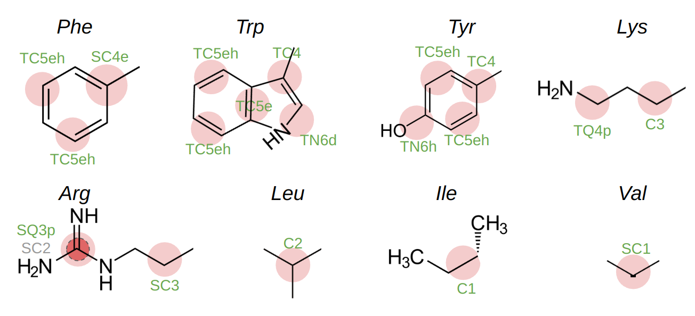

# Martini3_sc
**refined side chains for Martini3 proteins and its extensions to Martini3-IDP model** 

### refined side chains topology
side chain adjustment includes aromatic residues (F/Y/W), positive charged residues (R/K) and some hydrophobic residues (I/L/V)

### residue binding 1D PMF
 - enhance cation- interactions and apolar residue homodimerization;
 - fine-tune aromatic residue dimerization;
 - capture the difference between Arg and Lys.

### refined binding mode of aromatic rings with increasing size

### performace validation in diverse protein systems
 - protein associations;
 - transmembrnae protein stability;
 - peripheral protein-membrane binding;
 - transmembrane protein dimeriaztions.

### extensions to Martini3-IDP model
 - IDP/MDP conformation agreement again experiments remains;
 - fuzzy protein complex driven by IDRs;
 - IDP-ligand binding;
 - more accurate LLPS profile with near-quantitative thermodynamics prediction (such as saturation concentration)

